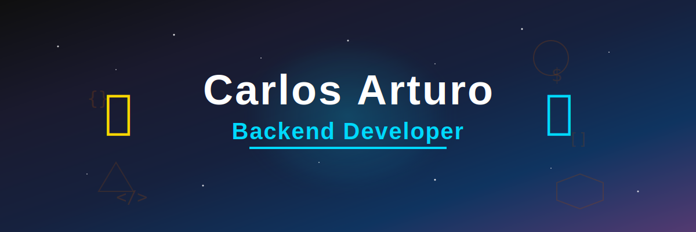

  

# ¡Hola! 👋 Soy Arturo

## 👨‍💻 Sobre mí

Soy **Arturo Roncal**, un apasionado **desarrollador backend en formación** desde **Perú 🇵🇪**.

🎓 Actualmente estudiante de **Computación e Informática en Cibertec (6to ciclo)**.
 
🚀 Me especializo en **Java, Spring Boot, Angular, MySQL y APIs REST**.
 
✨ Me encanta crear proyectos que solucionen problemas reales y siempre estoy en busca de aprender nuevas tecnologías.
 

## 🔧 Tecnologías más usadas

  
  
  
  
  
  
  
  
  
  
  
  
  
  
  
  
  
  
  
  
  
  
  
  

## 📊 Mis estadísticas en GitHub

*¡Gracias por visitar mi perfil! 🚀*
