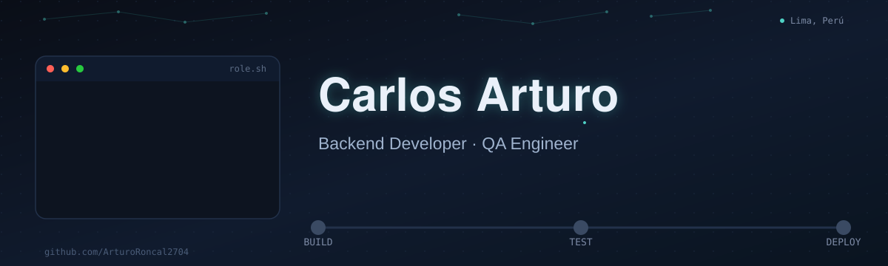

  

---

### 👋 ¡Hola! Soy Arturo Roncal

---

### 👨‍💻 Sobre mí

Soy Carlos Arturo Roncal, desarrollador backend egresado de la carrera de Computación e Informática en Cibertec. Me especializo en la construcción de sistemas robustos y escalables utilizando Java con Spring Boot.

Cuento con experiencia en el diseño de arquitectura de microservicios y gestión de bases de datos como Oracle PL/SQL, MySQL y SQL Server. Me apasiona aplicar principios de Clean Code, explorar nuevas tecnologías en la nube y seguir evolucionando profesionalmente para aportar soluciones innovadoras.

---

### 🔧 Tecnologías más usadas

  <!-- Backend -->
  
  
  
  

  <!-- Bases de datos -->
  
  
  
  
  
  
  
  

  <!-- Infraestructura / Mensajería -->
  
  
  
  

  <!-- Frontend -->
  
  

  <!-- Herramientas -->
  
  
  
  
  
  

---

### 📊 Mis estadísticas en GitHub

    

    

  
  
    

  

---

<i>Gracias por visitar mi perfil. Siempre abierto a aprender, colaborar y crear proyectos que generen impacto real. 🚀</i>

